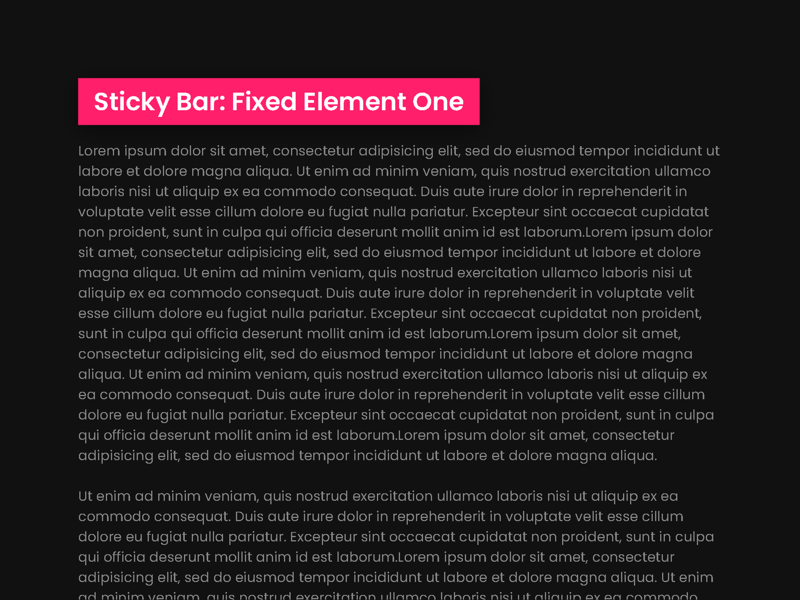

<h1 align = "center">
 
  
   
     
  Sticky Bar: Fixed Elements
   
</ H1>

<h3 align = "center"> User Centric Development </h3>

## Sticky Bar

Fixed element css effects

## Project Specifications

- Sticky bar remains fixed on page when user scrolls.